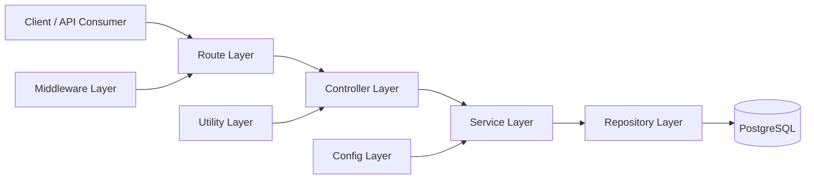

# InventoryHub

InventoryHub is a Node.js and Express backend for managing users, categories, products, and orders. It uses PostgreSQL for persistence, JWT for authentication, and Swagger for API documentation.

## Features

- User registration and login
- JWT-based authentication
- Current user lookup
- Category management
- Product management
- Order creation and retrieval
- PostgreSQL database schema for inventory and order tracking
- Centralized API response format
- Interactive Swagger API documentation

## Technologies Used

- Node.js
- Express
- PostgreSQL
- pg
- bcrypt
- jsonwebtoken
- cors
- dotenv
- swagger-jsdoc
- swagger-ui-express
- nodemon

## Project Structure

- `src/app.js` - Express app configuration and route registration
- `src/server.js` - Server bootstrap
- `src/config/db.js` - PostgreSQL connection pool
- `src/config/swagger.js` - Swagger/OpenAPI configuration
- `src/controllers` - Route handlers
- `src/services` - Business logic
- `src/repositories` - Database access layer
- `src/routes` - API route definitions
- `src/middlewares` - Authentication middleware
- `src/util` - Shared utilities
- `src/database/schema.sql` - Database schema

## Architecture Overview

InventoryHub follows a layered Express architecture that keeps routing, business logic, and persistence separated.

### Request Flow



### Layer Responsibilities

- Route layer maps HTTP methods and paths to controllers.
- Middleware layer handles cross-cutting concerns such as authentication.
- Controller layer validates incoming data at the endpoint boundary and returns standardized responses.
- Service layer contains the application rules and orchestrates business operations.
- Repository layer handles database reads and writes.
- Config files centralize infrastructure setup such as the database pool and Swagger.
- Utility modules provide shared helpers used across multiple layers.

### File and Folder Focus

- `src/app.js` wires middleware, Swagger, and all API routes.
- `src/server.js` starts the HTTP server.
- `src/controllers` contains one controller per domain area: auth, health, categories, products, and orders.
- `src/services` holds the business logic for each domain.
- `src/repositories` contains persistence logic for database access.
- `src/routes` defines the public API surface and Swagger annotations.
- `src/middlewares/authMiddleware.js` protects authenticated routes with JWT verification.
- `src/util/handleResponse.js` keeps API responses consistent across the project.
- `src/database/schema.sql` defines the full relational schema used by the application.

## Database Schema

The application includes the following tables:

- `users`
- `categories`
- `products`
- `orders`
- `order_items`

Relationships:

- Each product belongs to one category
- Each order belongs to one user
- Each order can contain multiple order items
- Each order item references a product and an order

## Getting Started

### Prerequisites

- Node.js
- PostgreSQL

### Installation

1. Clone the repository.
2. Install dependencies:

```bash
npm install
```

3. Create a `.env` file in the project root with the required variables.

### Environment Variables

```env
PORT=3000
DB_HOST=localhost
DB_USER=postgres
DB_PASSWORD=your_password
DB_DBNAME=inventoryhub
DB_DBPORT=5432
JWT_SECRET=your_jwt_secret
```

### Database Setup

Run the SQL script in `src/database/schema.sql` against your PostgreSQL database to create the tables.

### Run the Application

Development mode:

```bash
npm run dev
```

The server runs on the configured `PORT` or defaults to `3000`.

## API Documentation

Swagger UI is available at:

```text
/api-docs
```

## API Response Format

Most endpoints return a consistent JSON response:

```json
{
  "success": true,
  "message": "Operation completed successfully",
  "data": {}
}
```

## Authentication

Protected routes require a Bearer token in the `Authorization` header:

```http
Authorization: Bearer <token>
```

## Routes

### Health

| Method | Route | Protected | Description |
| --- | --- | --- | --- |
| GET | `/health` | No | Health check |

### Auth

| Method | Route | Protected | Description |
| --- | --- | --- | --- |
| POST | `/api/v1/auth/register` | No | Register a new user |
| POST | `/api/v1/auth/login` | No | Login and receive a JWT |
| GET | `/api/v1/auth/me` | Yes | Get the current authenticated user |

### Categories

| Method | Route | Protected | Description |
| --- | --- | --- | --- |
| POST | `/api/v1/categories` | Yes | Create a category |
| GET | `/api/v1/categories` | Yes | Get all categories |
| GET | `/api/v1/categories/:id` | Yes | Get a category by ID |
| PUT | `/api/v1/categories/:id` | Yes | Update a category |
| DELETE | `/api/v1/categories/:id` | Yes | Delete a category |

### Products

| Method | Route | Protected | Description |
| --- | --- | --- | --- |
| POST | `/api/v1/products` | Yes | Create a product |
| GET | `/api/v1/products` | Yes | Get all products |
| GET | `/api/v1/products/:id` | Yes | Get a product by ID |
| PUT | `/api/v1/products/:id` | Yes | Update a product |
| DELETE | `/api/v1/products/:id` | Yes | Delete a product |

### Orders

| Method | Route | Protected | Description |
| --- | --- | --- | --- |
| POST | `/api/v1/orders` | Yes | Create an order |
| GET | `/api/v1/orders` | Yes | Get all orders for the current user |
| GET | `/api/v1/orders/:id` | Yes | Get an order by ID |

## Notes

- All protected endpoints require a valid JWT.
- The API uses a shared response helper for consistent success and error payloads.
- Swagger annotations are defined directly in the route files.
